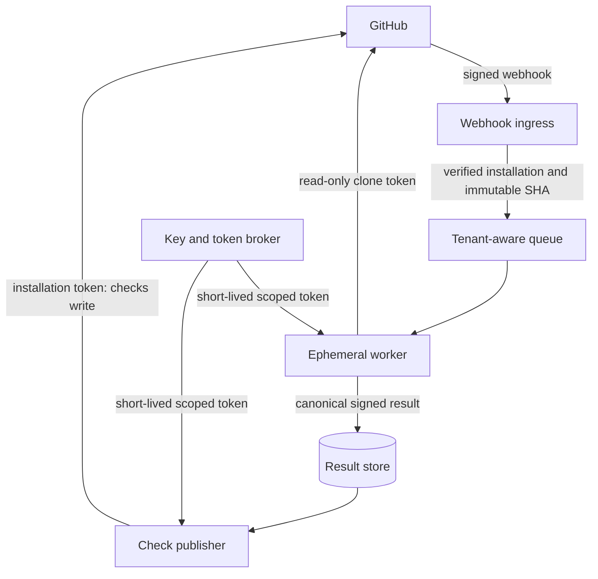

# ProofRail Architecture

## Purpose and scope

ProofRail evaluates a repository change and produces evidence-backed findings, policy decisions, and machine-readable reports. Version 1 never executes code from the repository being analyzed, never infers AI authorship, and never treats an unavailable analyzer as a pass.

The product grows through three deployment forms that share one deterministic engine:

1. A local CLI operating on a Git worktree or an exported diff.
2. A reusable GitHub Action invoking the same CLI on a pull request.
3. A hosted GitHub App that schedules isolated analysis jobs and publishes checks.

The CLI and Action are the approved implementation scope. The hosted App remains conditional on the promotion gates in [validation-gates.md](validation-gates.md).

## Components

| Component | Responsibility | Trust level | Network access in MVP |
|---|---|---|---|
| Input resolver | Bind base SHA, head SHA, repository root, and base-branch policy | Security critical | None |
| Parsers | Convert Git diffs, workflow YAML, manifests, and lockfiles into bounded internal records | Treat all content as hostile | None |
| Analyzer registry | Run allow-listed built-in analyzers with explicit budgets | Trusted product code | None |
| Finding aggregator | Normalize, fingerprint, deduplicate, and sort findings | Trusted product code | None |
| Policy evaluator | Evaluate restricted declarative rules over normalized findings | Trusted product code; policy is untrusted data | None |
| Reporters | Write console, canonical JSON, job-summary Markdown, and SARIF 2.1.0 | Trusted product code | None |
| GitHub Action wrapper | Resolve event metadata, check out exact revisions, run the CLI, preserve outputs | Partially trusted CI boundary | GitHub only through standard Actions features |
| Hosted control plane | Verify webhooks, authorize installations, queue jobs, and publish checks | Future privileged service | GitHub API and approved metadata sources |
| Hosted worker | Analyze one immutable revision in an ephemeral tenant-scoped job | Future isolated worker | Deny by default; allow-listed destinations only |

## Canonical pipeline

```mermaid
flowchart LR
    PR[Pull request or local Git change] --> IR[Input resolver]
    BP[Policy from base revision] --> IR
    IR --> P[Bounded parsers]
    P --> A1[Workflow analyzer]
    P --> A2[Dependency-delta analyzer]
    P --> A3[Security-sensitive diff classifier]
    A1 --> F[Canonical findings]
    A2 --> F
    A3 --> F
    F --> E[Restricted policy evaluator]
    E --> D{Decision}
    D -->|pass, warn, require review, block| R[JSON, console, Markdown, SARIF]
    P -->|parse or budget failure| I[Incomplete result]
    A1 -->|analyzer failure| I
    A2 -->|analyzer failure| I
    A3 -->|analyzer failure| I
    I --> R
```

## Input binding and configuration precedence

ProofRail binds every run to an immutable tuple:

```text
repository identity + base commit SHA + head commit SHA + policy digest + engine version
```

The evaluator loads `.proofrail/policy.yml` from the base revision by default. A pull request cannot relax the policy used to judge itself. A proposed policy change is analyzed as data and takes effect only after it reaches the default branch. Local users may supply an explicit policy path, and the report records that path and digest.

Precedence is fixed:

1. Engine safety invariants that cannot be disabled.
2. Base-revision repository policy.
3. Explicit CLI presentation options that cannot weaken policy.

Environment variables may select output paths and resource budgets but may not introduce executable extensions or override a blocking decision.

If the base revision has no repository policy, ProofRail uses a versioned built-in policy shipped inside the binary. The built-in policy blocks `incomplete`, blocks high-confidence `PFR-WF-001`, `PFR-WF-004`, `PFR-WF-005`, `PFR-DEP-001`, and `PFR-DEP-004`, requires review for the other version 1 workflow and dependency rules, requires review for every `PFR-DIFF` classification, and records its own content digest. A malformed repository policy does not fall back to this default; it produces `incomplete` so a broken policy cannot silently change enforcement.

## Canonical finding and run result

Every finding contains:

```text
schema_version
rule_id
analyzer_id and analyzer_version
title and explanation
severity: critical | high | medium | low | note
confidence: high | medium | low
decision_hint: block | require_review | warn | observe
locations[]: path, start_line, end_line
evidence[]: kind, source, digest, excerpt_or_value
limitations[]
fingerprint
```

Excerpts are length-bounded and redacted. Secret values are never included. Fingerprints derive from the rule, normalized location, and stable evidence—not from mutable prose.

Every run produces exactly one status:

- `pass`: all required analyzers completed and no policy rule blocked.
- `warn`: all required analyzers completed and non-blocking findings exist.
- `require_review`: all required analyzers completed and policy requires an authorized reviewer.
- `block`: all required analyzers completed and policy rejects the change.
- `incomplete`: an input, parser, required analyzer, or report integrity check failed.

CLI exit codes are `0` for `pass` or `warn`, `1` for `require_review` or `block`, and `2` for `incomplete` or internal error. A repository that wants a warning to fail CI must express that as a policy rule producing `require_review` or `block`; presentation settings cannot change exit semantics, and no configuration may map `incomplete` to `pass`.

## GitHub Action execution model

The supported event is `pull_request`. The Action must not use `pull_request_target` to check out or execute pull-request content. The default job declares only `contents: read`; optional SARIF publication uses a separate job with `security-events: write` and `actions: read` where required. Fork pull requests receive no secrets and remain analyzable because the MVP is offline.

The workflow:

1. Checks out the base and head commits by immutable SHA.
2. Reads policy from the base commit.
3. Runs the pinned ProofRail release without executing repository scripts.
4. Uploads canonical JSON and SARIF as workflow artifacts.
5. Writes a job summary.
6. Optionally uploads SARIF when the repository's GitHub plan supports code scanning.

SARIF is an interoperability view, not the source of truth. Canonical JSON preserves policy decisions, incomplete states, evidence digests, and analyzer limitations that GitHub's SARIF presentation may omit.

GitHub recommends least-privilege `GITHUB_TOKEN` permissions, read-only tokens and no secrets for ordinary fork `pull_request` workflows, full commit-SHA pinning for third-party Actions, and avoiding untrusted checkouts under `pull_request_target`. See the official [workflow permission reference](https://docs.github.com/en/actions/reference/workflows-and-actions/workflow-syntax), [secure use reference](https://docs.github.com/en/actions/reference/security/secure-use), and [SARIF upload guidance](https://docs.github.com/en/code-security/how-tos/find-and-fix-code-vulnerabilities/integrate-with-existing-tools/upload-sarif-file).

## Hosted GitHub App boundary

The future App separates the privileged control plane from untrusted analysis:



Required controls before a private beta:

- Webhook signature verification before parsing business fields.
- Installation-to-repository authorization on every event.
- One ephemeral workspace and process identity per job.
- No cross-tenant caches containing repository content.
- Short-lived installation tokens issued only to the component that needs them.
- Separate read and publish capabilities.
- Egress allow-listing and no execution of repository code.
- Encryption in transit and at rest for retained metadata.
- Tenant-scoped logs, quotas, deletion, and audit records.
- A kill switch that stops new jobs and disables result publication.

## Overrides and waivers

An override is not a command-line `--force` switch. A waiver is a declarative record stored on the protected default branch with:

- finding fingerprint or rule and bounded path scope;
- justification;
- approving actor or team;
- creation and expiry timestamps;
- associated issue or risk-acceptance record.

A pull request cannot approve a waiver that it introduces. ProofRail reports every applied waiver and its digest. Expired, malformed, or broadened waivers are ignored and produce a finding.

## Resource limits and safe failure

All parsers and analyzers receive limits for file count, changed bytes, individual file size, YAML alias expansion, recursion depth, and wall-clock time. Limit exhaustion produces `incomplete`, identifies the affected analyzer, and preserves other results. Outputs are written atomically after schema validation. An interrupted run cannot leave a valid-looking partial report.

## Explicit non-goals for version 1

- Executing tests, build scripts, package-manager hooks, or repository binaries.
- Proving the absence of vulnerabilities.
- Attribution of code to an AI model or human author.
- Automatic remediation commits or merges.
- Arbitrary third-party analyzer plugins.
- Live registry, CVE, or package-reputation queries.
- Multi-tenant hosting.
