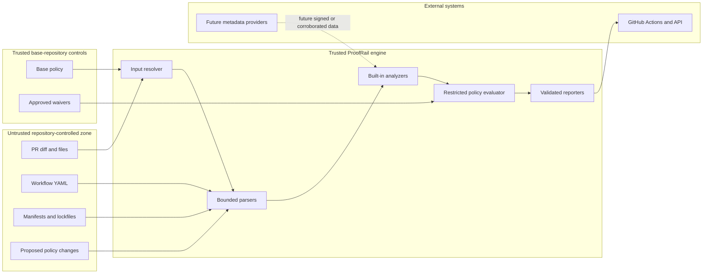

# ProofRail Threat Model

## 1. Overview

### Intended use

ProofRail analyzes repository changes and emits evidence-backed findings and policy decisions before merge. The approved initial deployment is a local CLI and GitHub Action; a multi-tenant GitHub App is a later, separately gated deployment (`README.md:3`, `README.md:7`).

This is a design-phase model. The repository contains no runtime implementation yet, so architecture statements cite approved design sources and remain requirements to verify against code during implementation. Threat scenarios are hypotheses, not confirmed vulnerabilities.

### Components and evidence

| Component | Security responsibility | Current evidence |
|---|---|---|
| Input resolver | Bind immutable revisions and base policy | `docs/architecture.md:52` |
| Bounded parsers | Parse hostile diffs, YAML, and dependency files without execution | `docs/architecture.md:15` |
| Built-in analyzers | Produce findings from allow-listed deterministic logic | `docs/architecture.md:15` |
| Policy evaluator | Apply restricted rules without arbitrary code execution | `docs/architecture.md:72` |
| Reporters | Preserve status, evidence, limitations, and integrity | `docs/architecture.md:72` |
| GitHub Action | Run with minimum permissions on the `pull_request` event | `docs/architecture.md:102` |
| Hosted control plane and workers | Future webhook, authorization, isolation, scheduling, and publication | `docs/architecture.md:119` |

### Trust-zone diagram

### Effective resources and capabilities

| Deployment or workflow | Resource or capability | Configuration and precedence | Safe effective value or location | Readers, writers, or recipients | Enforcing control | Evidence or unknowns |
|---|---|---|---|---|---|---|
| Local CLI | Repository content | Explicit repository root and immutable base/head revisions | User-selected authorized worktree | CLI process reads; reporters write only configured output | Path normalization, no repository code execution, atomic output | Required by `docs/architecture.md:52`; implementation unverified |
| Local CLI | Policy | Engine invariants override base policy; presentation flags cannot weaken policy | `.proofrail/policy.yml` from base revision by default | Input resolver and policy evaluator | Policy digest bound into run identity | Required by `docs/architecture.md:52`; implementation unverified |
| GitHub Action | `GITHUB_TOKEN` | Workflow/job `permissions` | `contents: read`; separate optional SARIF publisher gets only required write scope | Checkout and optional GitHub publisher | GitHub-issued job token and explicit permissions | Required by `docs/architecture.md:102`; repository settings remain a caller obligation |
| GitHub Action | Fork pull-request content | `pull_request`, never privileged untrusted checkout | Ephemeral GitHub-hosted workspace without secrets | Parsers and analyzers read | GitHub fork restrictions plus ProofRail offline execution | Required by `docs/architecture.md:102`; self-hosted runners excluded initially |
| Hosted App, future | Installation tokens | Brokered per component and job | Short-lived, repository-scoped token | Clone worker or check publisher, not both by default | Token broker and installation authorization | Required by `docs/architecture.md:136`; provider and storage design unresolved until App phase |
| Hosted App, future | Repository workspace | Queue binds tenant, repository, and immutable SHA | Fresh ephemeral workspace per job | One worker identity | Scheduler and runtime isolation | Required by `docs/architecture.md:136`; container/runtime choice unresolved |
| Hosted App, future | Result metadata | Tenant-scoped retention and deletion policy | Encrypted tenant partition | Tenant-authorized UI/API and publisher | Authorization on every read/write | Required by `docs/architecture.md:136`; database design unresolved |

## 2. Threat Model, Trust Boundaries, and Assumptions

### Protected assets

- Integrity of pass, warn, review, block, and incomplete decisions.
- Integrity and provenance of analyzer evidence and report fingerprints.
- Confidentiality of repository content, secrets, tokens, and private metadata.
- Integrity of base-branch policies, approved waivers, and promotion gates.
- Availability of CI and the ability to fail visibly without creating false assurance.
- Tenant isolation and scoped GitHub authority in the future hosted service.
- Auditability of overrides, versions, actors, and exact revisions.

### Security objectives and invariants

1. Untrusted repository content is parsed as data and never executed by the MVP.
2. A pull request cannot weaken the policy or waiver set used to evaluate itself.
3. An unavailable required analyzer cannot produce a pass.
4. AI-generated explanation cannot create, suppress, or change a blocking finding without deterministic evidence and policy.
5. Secret material is never copied into findings, logs, SARIF, or excerpts.
6. Every report is bound to exact revisions, policy digest, and engine version.
7. CI credentials are least-privileged and unavailable to forked untrusted content.
8. A waiver uses an exact fingerprint and path set, is attributable, expires within 30 days, and is auditable (`docs/architecture.md:149`).
9. Parser and analyzer resource exhaustion is bounded and yields `incomplete` (`docs/architecture.md:163`).
10. A future tenant cannot read, influence, or receive another tenant's repository content, policy, results, cache, or credentials.
11. No agent or repository instruction may override provider safeguards or owner-only authority (`GOVERNANCE.md:3`).

### Trust boundaries

| Boundary | Attacker-controlled input or authority | Expected control | Failure consequence |
|---|---|---|---|
| Repository content → parser | Paths, diffs, YAML, manifests, lockfiles, encodings, sizes | Canonical paths, safe YAML mode, schema limits, no execution | Parser compromise, denial of service, skipped analysis, misleading location |
| Pull-request branch → policy evaluator | Proposed policy and waiver changes | Load effective policy and waivers from base revision | PR self-approval or suppressed finding |
| Analyzer → aggregator | Findings and analyzer status | Built-in registry, schemas, deterministic ordering, explicit completion | Forged, dropped, duplicated, or mis-scored findings |
| Policy data → policy engine | User-authored rules and selectors | Restricted declarative schema, bounded evaluation | Arbitrary execution, denial of service, unexpected allow decision |
| Engine → reports | Evidence, snippets, status, errors | Redaction, output schema validation, atomic writes | Secret leakage or valid-looking partial result |
| GitHub event → Action | Event metadata, fork state, commit references | Immutable SHA binding, `pull_request`, least privilege | Checkout confusion, token or secret theft, analysis of wrong revision |
| External metadata → future analyzer | Registry identity, advisories, signatures, availability | Timeouts, provenance, caching, corroboration, stale markers | Poisoned evidence, inconsistent results, outage-driven false pass/block |
| GitHub → future App ingress | Webhook payload and claimed installation | Signature verification before authorization | Cross-repository action or forged job |
| Control plane → worker | Tenant, repository, SHA, token capability | Authenticated queue message and per-job identity | Cross-tenant access or excess GitHub authority |
| Worker → result store/publisher | Findings from hostile repository data | Tenant binding, signed result digest, output validation | Stored injection, result substitution, cross-tenant leak |

### Attacker capabilities

The primary attacker can open or modify a pull request and therefore controls changed paths, file contents, Git metadata visible in the PR, workflow YAML, manifests, and proposed ProofRail policy changes. The attacker does not initially control the protected base branch, repository owner account, GitHub platform, ProofRail release signing identity, or future control-plane secrets.

A supply-chain attacker may control a referenced third-party Action, package, registry response, advisory feed, or ProofRail dependency. A malicious or compromised maintainer may have more authority, but owner-level compromise is not treated as a vulnerability ProofRail can prevent; audit preservation and blast-radius reduction still apply.

### Assumptions and exclusions

- Initial use is limited to repositories the operator is authorized to analyze.
- MVP execution occurs on GitHub-hosted runners or an equivalently ephemeral environment. Self-hosted runners require a separate model.
- The MVP is offline after checkout and does not query registries or vulnerability services.
- Git itself and the host operating system are external trusted computing-base dependencies.
- ProofRail does not prove that code is secure; it enforces defined checks and reports coverage limitations.
- AI authorship attribution is explicitly excluded.
- Automatic remediation, merge, deployment, and arbitrary plugin execution are excluded.
- The hosted App's infrastructure provider, region, retention window, key manager, database, and sandbox implementation remain unresolved until its design gate; no claim of production isolation is made before then.
- Version 1 makes no PCI DSS, SOC 2, ISO 27001, HIPAA, FedRAMP, or other regulatory or certification claim. Future compliance scope requires owner approval, legal review, control mapping, and operating evidence.

## 3. Attack Surface, Mitigations, and Attacker Stories

All scenarios below are design hypotheses. They become findings only if implementation evidence demonstrates a failing control.

| Priority | Scenario and capability gain | Prerequisites | Impact | Existing design controls | Required mitigation and validation | Evidence |
|---|---|---|---|---|---|---|
| Critical | A hostile PR uses a parser bug to execute code in the analysis process and steal CI authority | Exploitable parser defect; token available to same process | Repository modification, secret theft, supply-chain compromise | No repository execution; minimum token permissions | Memory-safe or hardened parsers, fuzzing, size/depth limits, fork tests, separate write publisher | `docs/architecture.md:102`, `docs/architecture.md:163` |
| Critical | A future worker receives or accesses another tenant's token or repository | Hosted App enabled; isolation or queue authorization defect | Cross-tenant data and repository compromise | Per-job workspace, scoped tokens, tenant-aware queue | Adversarial tenant-isolation tests, separate capabilities, no shared content cache, audited token broker | `docs/architecture.md:136` |
| High | A PR changes its policy or adds a waiver so the same PR passes | Policy loaded from head or waiver approval not separated | Security checks bypassed | Base-revision policy and protected-branch waivers | Conformance tests that head policy never controls current evaluation; report both digests | `docs/architecture.md:52`, `docs/architecture.md:149` |
| High | `pull_request_target` or a privileged `workflow_run` checks out hostile pull-request code | Unsafe workflow configuration | Token/secret theft and repository write | Only `pull_request`; no repository code execution | Workflow analyzer flags both patterns; end-to-end fork PR fixture | `docs/architecture.md:102` |
| High | A compromised ProofRail release or third-party Action falsifies results | Mutable tags or compromised release chain | Broad false assurance across adopters | Planned pinned releases and evidence versioning | Signed release provenance, full-SHA pinning, reproducible build evidence, emergency revocation | `docs/architecture.md:110`, `docs/architecture.md:117`; implementation pending |
| High | A required analyzer crashes and the aggregator emits pass from remaining results | Error-handling defect | Dangerous change accepted with incomplete coverage | Explicit `incomplete` status and exit code 2 | Fault-injection test for every analyzer and reporter stage | `docs/architecture.md:72`, `docs/architecture.md:163` |
| High | Malicious policy input triggers arbitrary code execution or non-terminating evaluation | Turing-complete evaluation or unsafe deserialization | CI compromise or denial of service | Restricted declarative policy | Schema validation, no dynamic imports/functions, operation budget, policy fuzzing | `docs/decisions/0001-restricted-policy-model.md:11` |
| Medium | Path normalization lets one file masquerade as another or escape the repository | Crafted path, symlink, case or separator edge case | Skipped analysis or misleading report | Repository-root binding and canonical locations | Cross-platform path corpus, symlink policy, reject out-of-root paths | `docs/architecture.md:52` |
| Medium | Evidence excerpts leak a newly added credential into logs or SARIF | Secret-like content in changed line | Credential disclosure | Redacted, bounded excerpts | Secret-token canaries in reporter tests; store digests instead of values | `docs/architecture.md:72` |
| Medium | Poisoned or stale external metadata causes incorrect dependency decisions | Future online metadata enabled | False block or false pass | Online metadata excluded from MVP | Multiple evidence sources, signed provenance where available, freshness and outage state, never treat unavailable as clean | Explicit non-goal at `docs/architecture.md:178` |
| Medium | Analyzer noise repeatedly blocks legitimate changes | Weak rule, broad policy, or poor fixture coverage | CI disruption and policy abandonment | Confidence, limitations, review versus block distinction, waivers | Measured false-block budget, shadow mode, version rollback, scoped audited waivers | `docs/architecture.md:72`, `docs/architecture.md:149` |
| Medium | SARIF upload truncation or unsupported fields hide important context | Large/noisy result set or GitHub plan limitation | Incomplete GitHub presentation | Canonical JSON is source of truth | Limit result volume, verify SARIF, always retain canonical artifact and summary | `docs/architecture.md:102` |
| Low | Hostile Markdown or terminal sequences manipulate presentation | Crafted file names or evidence strings | Misleading local or GitHub UI | Structured fields and bounded output | Escape terminal control bytes and Markdown; snapshot tests | `docs/architecture.md:72` |

### Failure modes

| Failure | Required behavior |
|---|---|
| Diff cannot be resolved to exact SHAs | Stop with `incomplete`; emit no pass decision |
| Base policy missing | Apply documented secure default policy and record its digest; malformed policy is `incomplete` |
| Optional analyzer disabled | Record it as not run; policy cannot refer to it as satisfied |
| Required analyzer timeout or crash | Preserve completed findings but set whole run to `incomplete` |
| Reporter cannot write one requested format | Canonical result records reporter failure; CI result is `incomplete` |
| SARIF cannot upload | Preserve local artifacts; distinguish analysis success from publication failure |
| External metadata unavailable in a future online mode | Mark evidence stale or unavailable; never translate absence into safety |
| Policy ambiguity or unknown field | Reject the policy rather than guessing intent |
| Applied waiver expired or cannot be authenticated | Ignore waiver and emit a waiver-integrity finding |
| Hosted incident or isolation uncertainty | Stop new jobs, stop publication, revoke tokens, preserve tenant-scoped audit evidence, notify affected owners |

## 4. Severity Calibration

| Severity | ProofRail-specific example | Counterexample or downgrade condition |
|---|---|---|
| Critical | Untrusted PR input produces code execution with a write-capable token; cross-tenant token or repository access in the hosted App; release-signing compromise affecting distributed binaries | Parser crash with no secret or write authority is not critical; tenant impact is unsupported before multi-tenancy exists |
| High | PR-controlled policy bypass; privileged `pull_request_target` execution of hostile content; required-analyzer failure reported as pass; arbitrary execution through policy | A non-blocking risk label with no effect on decision integrity is lower |
| Medium | Secret value emitted into a restricted artifact; repeatable false blocking; poisoned optional metadata; misleading path attribution | A redacted fingerprint without recoverable secret value may be low |
| Low | Escaped presentation defect, incomplete wording, or noisy informational classification with no policy effect | Style preferences and documented intended behavior are not security findings |

Severity describes impact under stated prerequisites. Confidence describes evidence strength and must not reduce a potentially critical impact merely because implementation is not yet available. Design hypotheses remain open verification work, not vulnerabilities.
